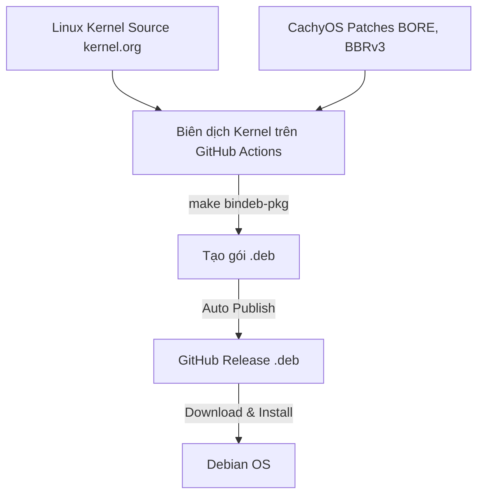

# Debian CachyOS Kernel Automator 🚀

Dự án tự động tải **Mã nguồn Linux Kernel gốc**, áp dụng **Bộ Patch CachyOS (BORE Scheduler, BBRv3, AMD P-State...)**, đóng gói thành các file `.deb` chuẩn cho **Debian** bằng **GitHub Actions**, và phát hành lên **GitHub Releases**.

---

## 📌 Cách hoạt động



---

## ⚡ Cách kích hoạt Build tự động trên GitHub

1. Push mã nguồn này lên GitHub Repository của bạn:
   ```bash
   git add .
   git commit -m "Update default kernel version to Linux 7.2.2"
   git push
   ```

2. Truy cập vào GitHub Repository -> Vào tab **Actions** -> Chọn **Build Debian CachyOS Kernel**.

3. Nhấn **Run workflow** và điền các thông số:
   - **Linux Kernel Version**: `7.2.2` (Phiên bản Linux Kernel mới nhất hiện tại).
   - **CachyOS Patch Set Version**: `7.2` (Phiên bản bộ patch CachyOS tương ứng).
   - **CPU Scheduler**: `bore` (Chọn CPU Scheduler BORE hoặc `eevdf`).
   - **Kernel Suffix**: `-cachyos`.

4. Nhấn **Run workflow** và chờ GitHub Actions đóng gói (khoảng 20–30 phút).

---

## 📥 Cách cài đặt trên Debian

Sau khi GitHub Actions build hoàn tất, truy cập tab **Releases** trên GitHub Repo của bạn để tải các file `.deb` về:

```bash
# Di chuyển tới thư mục chứa các file .deb vừa tải
cd ~/Downloads

# Cài đặt Kernel Image & Headers
sudo dpkg -i linux-image-*.deb linux-headers-*.deb

# Cập nhật GRUB Bootloader
sudo update-grub

# Khởi động lại hệ thống
sudo reboot
```

Kiểm tra kernel sau khi reboot:
```bash
uname -r
# Kết quả sẽ có dạng: 7.2.2-cachyos
```
