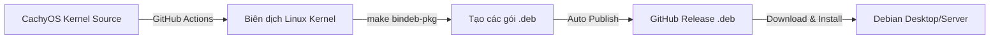

# Debian CachyOS Kernel Automator 🚀

Dự án tự động kéo mã nguồn **Kernel CachyOS**, biên dịch thành các gói cài đặt `.deb` chuẩn cho **Debian** bằng **GitHub Actions**, sau đó phát hành trực tiếp lên **GitHub Releases**.

---

## 📌 Cách hoạt động



---

## 🛠️ Hướng dẫn khởi tạo Repository trên GitHub

### 1. Khởi tạo Git & Push lên GitHub
Mở terminal tại thư mục dự án và chạy các lệnh sau:

```bash
git init
git add .
git commit -m "Initial commit: Add Debian CachyOS Kernel builder workflow"
git branch -M main
git remote add origin git@github.com:YOUR_USERNAME/debian-cachy.git
git push -u origin main
```

*(Thay `YOUR_USERNAME/debian-cachy.git` bằng link repository GitHub của bạn)*

---

## ⚡ Cách kích hoạt Build tự động

### Cách 1: Chạy thủ công (Workflow Dispatch)
1. Truy cập vào GitHub Repository của bạn.
2. Vào tab **Actions** -> Chọn **Build Debian CachyOS Kernel**.
3. Bấm **Run workflow**:
   - Chọn nhánh CachyOS (Mặc định: `6.13/master`).
   - Đặt suffix phiên bản (Mặc định: `-cachyos`).
4. Nhấn **Run workflow** và chờ GitHub Actions đóng gói (khoảng 20–30 phút).

### Cách 2: Tự động chạy định kỳ (Scheduled Cron)
Workflow đã được thiết lập sẵn để tự động chạy vào **00:00 UTC Chủ Nhật hàng tuần** nhằm cập nhật nhân CachyOS mới nhất.

---

## 📥 Cách cài đặt trên Debian

Sau khi GitHub Actions build xong, truy cập tab **Releases** trên GitHub Repo của bạn để tải các file `.deb` về và cài đặt:

```bash
# Di chuyển tới thư mục chứa các file .deb vừa tải về
cd ~/Downloads

# Cài đặt Kernel Image & Headers
sudo dpkg -i linux-image-*.deb linux-headers-*.deb

# Cập nhật GRUB Bootloader
sudo update-grub

# Khởi động lại hệ thống
sudo reboot
```

Sau khi khởi động lại, kiểm tra kernel đang chạy:
```bash
uname -r
# Kết quả sẽ có dạng: 6.13.x-cachyos
```

---

## ⚙️ Tùy chỉnh cấu hình Kernel (Nâng cao)

Nếu bạn muốn tùy chỉnh cấu hình kernel (ví dụ: bật/tắt module riêng, thay đổi scheduler):
1. Tạo file cấu hình tại: `config/custom.config` trong repo này.
2. Push lên GitHub. Workflow sẽ tự động ưu tiên file `custom.config` của bạn thay vì dùng `defconfig`.
